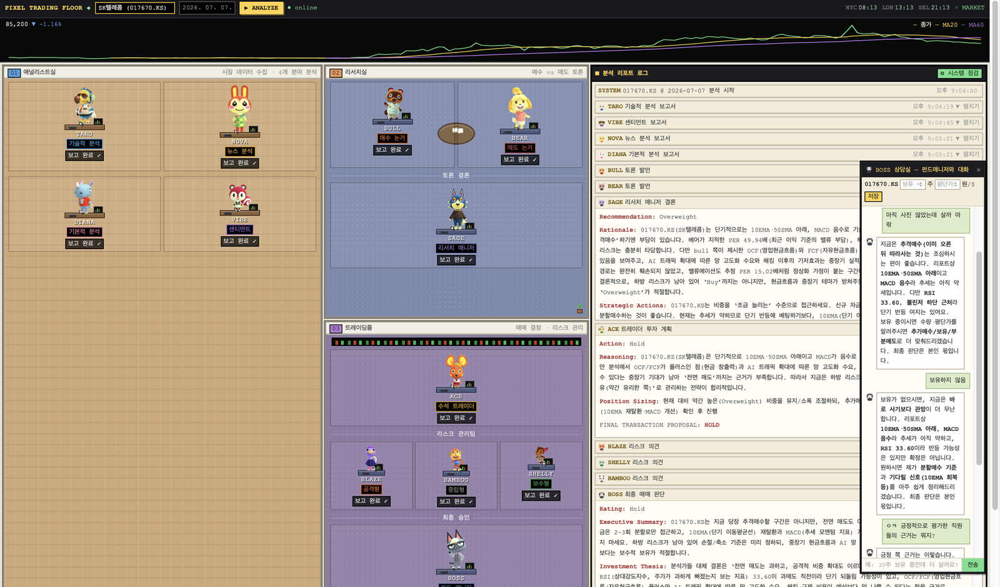

# 🏢 Trading Character Floor — TradingAgents 한국주식 커스터마이징

[TauricResearch/TradingAgents](https://github.com/TauricResearch/TradingAgents) 멀티에이전트 LLM 트레이딩 프레임워크를 한국 개인투자자용으로 확장한 프로젝트입니다.

> 여러 AI 애널리스트(기술적·뉴스·기본적·센티먼트)가 종목을 분석하고, Bull/Bear가 토론하고, 트레이더와 리스크팀이 최종 매매 판단을 내리는 과정을 그대로 재현합니다. TauricResearch는 미국 주식만 지원하지만, 이 버전은 **한국 종목을 API 키 없이** 분석하고 결과를 **한국어**로 출력하며, 그 과정을 **가상 사무실에서 실시간으로** 보여줍니다.



## 🔎 한눈에 비교

| 구분 | 원본 TradingAgents | 이 버전 (KR) |
|---|---|---|
| 대상 시장 | 미국(US) | **미국 + 한국(KOSPI/KOSDAQ)** |
| 한국 데이터 | ✗ | **네이버 금융 · KRX · FinanceDataReader (키 불필요)** |
| 티커 입력 | `AAPL` | `AAPL` · `005930` · `005930.KS` · `삼성전자` **자동 인식** |
| 리포트 언어 | 영어 | **한국어 (초보자 눈높이)** |
| 비용 | 설정에 따라 큼 | **회당 약 $0.05–0.15** (저비용 모델 조합) |
| 시각화 | CLI 텍스트 | **실시간 트레이딩 캐릭터 플로어(웹)** · 캐릭터 PNG 교체 가능 |

## ✨ 추가 기능

- **한국 주식(KOSPI/KOSDAQ) 지원** — API 키 없이 동작
  - 시세·기술지표: FinanceDataReader (네이버 차트)
  - 펀더멘털(PER/PBR/시총): 네이버 금융
  - 뉴스: 네이버 금융 한국어 기사
  - 티커 자동 라우팅: `005930`, `005930.KS`, `삼성전자` 모두 인식 → 미국 종목은 yfinance로 자동 분기
- **트레이딩 캐릭터 플로어 대시보드** (`dashboard/`)
  - 에이전트 12명(애널리스트 4 + 리서치 3 + 트레이딩 5)이 가상 사무실에서 실시간으로 분석하는 모습 시각화
  - WebSocket 토큰 스트리밍 말풍선, 종가+MA20/MA60 차트, 종목명 검색 자동완성
  - 분석 리포트 로그(마크다운 렌더링), 최종 판단 팝업
- **BOSS 상담실** — 분석 리포트 전체를 아는 펀드매니저 캐릭터와 채팅. 보유 수량·평단가를 저장(`~/.tradingagents/portfolio.json`)하면 내 포트폴리오를 반영해 상담
- **저비용 구성** — quick/deep 모델 분리 + 토론 1라운드로 1회 분석 비용 최소화, 리포트는 초보자 눈높이 한국어
- **커스텀 캐릭터** — `dashboard/static/sprites/{id}.png`를 넣으면 해당 캐릭터 교체 (없으면 내장 기본 캐릭터)

## 📦 설치

이 저장소 하나에 원본 TradingAgents가 통합되어 있어 **클론 → 설치 → 실행** 세 단계면 끝납니다. (별도로 원본을 받거나 패치할 필요 없음)

```bash
git clone https://github.com/shinhyekim80/tradingagents-kr-app.git
cd tradingagents-kr-app
conda create -n trading python=3.12 -y && conda activate trading
pip install -e .          # 대시보드·한국데이터 의존성까지 한 번에 설치

cp .env.example .env
# .env 에 OPENAI_API_KEY=sk-... 추가 (FRED_API_KEY 는 선택)
```

## 🚀 실행

```bash
python dashboard/server.py     # → http://localhost:8000
```

종목명(삼성전자) 또는 티커(005930.KS, AAPL) 입력 → **▶ ANALYZE**.
로그 패널의 **⚙ 시스템 점검** 버튼으로 데이터 소스·API 키 상태를 한 번에 확인할 수 있습니다.

CLI 일괄 분석도 가능:

```bash
python run_analysis.py 005930.KS AAPL --date 2026-07-07
```

## 🎮 등장 캐릭터

| 캐릭터 | 역할 | | 캐릭터 | 역할 |
|:--|:--|:-:|:--|:--|
| 🐱 **TARO** | 기술적 분석 | | 🐣 **NOVA** | 뉴스 분석 |
| 🐰 **DIANA** | 기본적 분석 | | 🐶 **VIBE** | 센티먼트 |
| 🐂 **BULL** / 🐻 **BEAR** | 매수·매도 토론 | | 🦉 **SAGE** | 리서치 매니저 |
| 🐹 **ACE** | 수석 트레이더 | | 🦊🐼🐢 **리스크팀** | 공격·중립·보수 |
| 🐧 **BOSS** | 펀드 매니저 (최종 승인) | | | |

## 🎨 커스텀 캐릭터

`dashboard/static/sprites/`에 아래 파일명(소문자)으로 **투명 배경 PNG**를 넣으면 교체됩니다.

`taro`(기술적) · `nova`(뉴스) · `diana`(기본적) · `vibe`(센티먼트) · `bull` · `bear` · `owl`(리서치 매니저) · `ace`(수석 트레이더) · `risky` · `neutral` · `safe`(리스크팀) · `boss`(펀드 매니저)

> ⚠️ 타인의 저작권이 있는 캐릭터 이미지는 **개인적으로만 사용하고 커밋/배포하지 마세요.**
> `.gitignore`가 `dashboard/static/sprites/`를 기본으로 제외합니다.

## 💸 비용

기본 설정(gpt-5.4-mini + nano, 토론 1라운드) 기준 1회 분석 약 **$0.05~0.15**, BOSS 상담은 회당 그보다 훨씬 저렴합니다. `dashboard/server.py`의 `build_config()`에서 모델 변경 가능.

## 📂 구성

| 경로 | 용도 |
|---|---|
| [`tradingagents/`](tradingagents/) | 원본 TradingAgents(Apache-2.0) + 한국 데이터 벤더 통합 |
| [`tradingagents/dataflows/krx.py`](tradingagents/dataflows/krx.py) | 한국 데이터 벤더 (신규) |
| [`dashboard/`](dashboard/) | 트레이딩 캐릭터 플로어 (FastAPI + WebSocket) |
| [`run_analysis.py`](run_analysis.py) | 저비용 CLI 일괄 분석 |
| [`cli/`](cli/) | 원본 대화형 CLI (`tradingagents` 명령) |
| [`INSTALL_KR.md`](INSTALL_KR.md) | 상세 설치·실행·비용·주의 가이드 |

## ⚠️ 한계 및 면책

- 네이버 금융 API는 비공식이라 응답 형식 변경 시 해당 데이터가 "없음" 처리됩니다 (값을 지어내지 않음).
- Reddit/StockTwits 센티먼트는 미국 중심이라 한국 종목엔 신호가 약합니다.
- **본 프로젝트는 연구·학습용입니다. 출력물은 투자 자문이 아니며, 모든 투자 판단과 책임은 본인에게 있습니다.**

## 📄 라이선스

Apache-2.0. 이 저장소는 [TauricResearch/TradingAgents](https://github.com/TauricResearch/TradingAgents)(Apache-2.0)를 **포함·수정하여 재배포**합니다. 원 저작권은 원저자에게 있으며, 한국 데이터 벤더(krx)·티커 라우팅·트레이딩 캐릭터 대시보드가 추가/수정된 부분입니다. 원본 라이선스 전문은 [LICENSE](LICENSE) 참고.
